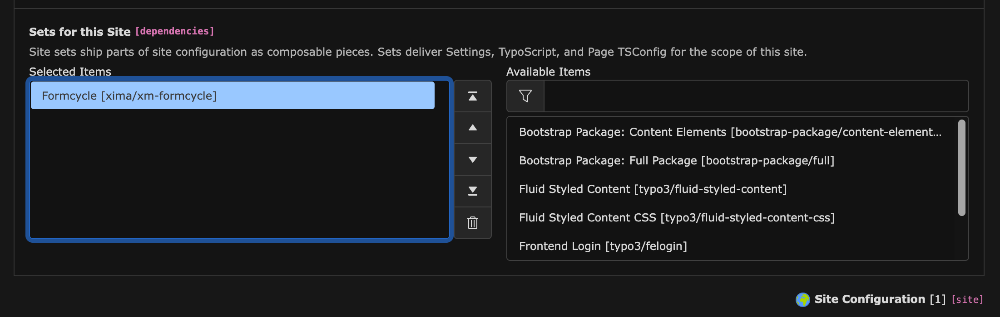
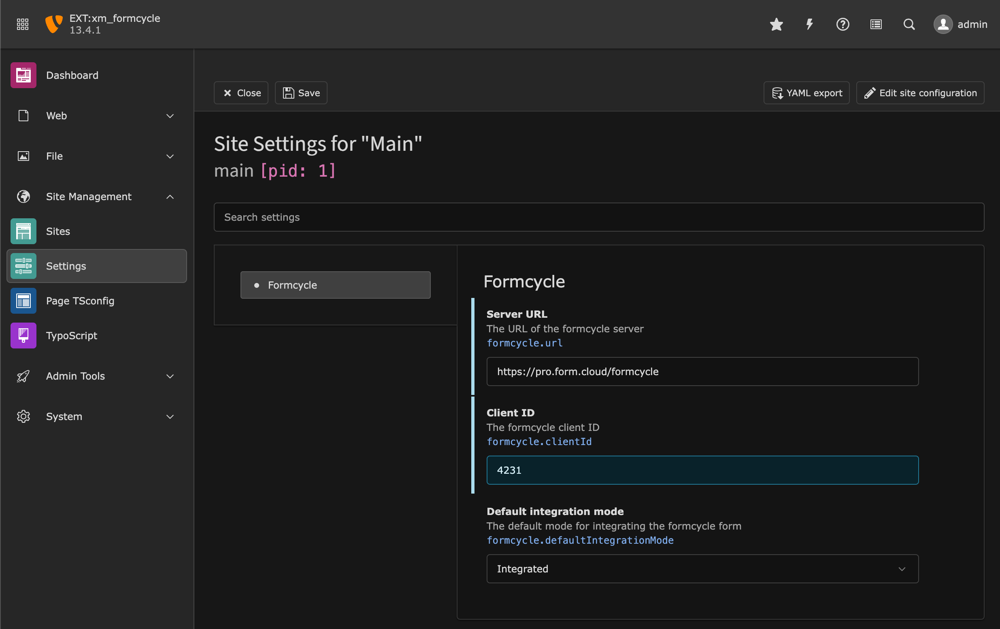

<div align="center">


# TYPO3 extension `xm_formcycle`


[](https://extensions.typo3.org/extension/ximaxm_formcycle)

[](https://extensions.typo3.org/extension/xm_formcycle)
[](https://github.com/xima-media/xm_formcycle/actions/workflows/tests.yml)
[](https://codecov.io/gh/xima-media/xm_formcycle)
[](https://packagist.org/packages/xima/xima-typo3-formcycle)

</div>

A TYPO3 extension that connects to [formcycle](https://www.formcycle.eu/). Select your created forms and embed
them into your TYPO3 site.

## Requirements

* formcycle version 8 + installed plugin `Formularliste`
* PHP 8.1+

## Installation

### Composer

```bash
composer require xima/xima-typo3-formcycle
```

### TER

[](https://extensions.typo3.org/extension/xm_formcycle)

Download the zip file from
[TYPO3 extension repository (TER)](https://extensions.typo3.org/extension/xm_formcycle).

## Configuration in TYPO3 v13

The configuration of formcycle has been moved to
the [Site Sets](https://docs.typo3.org/m/typo3/reference-coreapi/main/en-us/ApiOverview/SiteHandling/SiteSets.html). Just add the Formcycle
Site Set to your Site Configuration:



After that, you can enter your Formcycle credentials via the Site Settings module:



## Configuration in TYPO3 v11 & v12

After installation, enter your login data via extension configuration and include the TypoScript template for the
frontend rendering.

### 1. Extension configuration

Set your formcycle credentials in the extension configuration via TYPO3 backend or in your `config/system/settings.php`:

```php
'EXTENSIONS' => [
    'xm_formcycle' => [
        'formcycleUrl' => 'https://pro.formcloud.de/formcycle/',
        'formcycleClientId' => '4231',
    ],
]
```

### 2. TypoScript include

Include the static TypoScript template "formcycle" or directly import it in your sitepackage:

```typo3_typoscript
@import 'EXT:xm_formcycle/Configuration/TypoScript/setup.typoscript'
```

## Developer

If you want to modify the [fluid template](Resources/Private/Templates/Formcycle.html), add template paths via
TypoScript constants:

```typo3_typoscript
plugin.tx_xmformcycle {
    view {
        templateRootPath = EXT:your_ext/Resources/Private/Templates
        partialRootPath = EXT:your_ext/Resources/Private/Partials
        layoutRootPath = EXT:your_ext/Resources/Private/Layouts
    }
}
```

Copy and modify the `Formcycle.html` to the Templates directory.

## Migration from version 9 to 10

If you are upgrading from version 9 to 10 (TYPO3 v12 to v13), you need to perform the following steps:

### 1. Extension configuration

The extension configuration of the formcycle URL and formcycle client ID have been moved to the TYPO3 system settings. You need to manually
migrate the settings from `$GLOBALS['TYPO3_CONF_VARS']['EXTENSIONS']['xm_formcycle']` to the `config/settings/<identifier>/settings.yaml`.

### 2. Flexform settings

In version 10 of this extension, the flexform settings have been moved to regular TCA fields. To migrate your existing content elements, run
the Upgrade Wizard in the TYPO3 backend or via CLI:

```bash
typo3 upgrade:run xm_formcycle
```

## License

This project is licensed under [GNU General Public License 2.0 (or later)](LICENSE.md).
