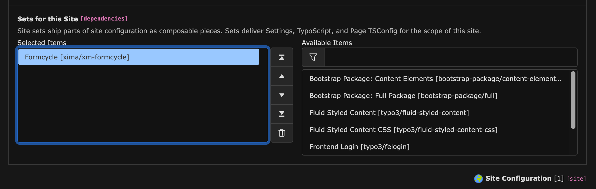
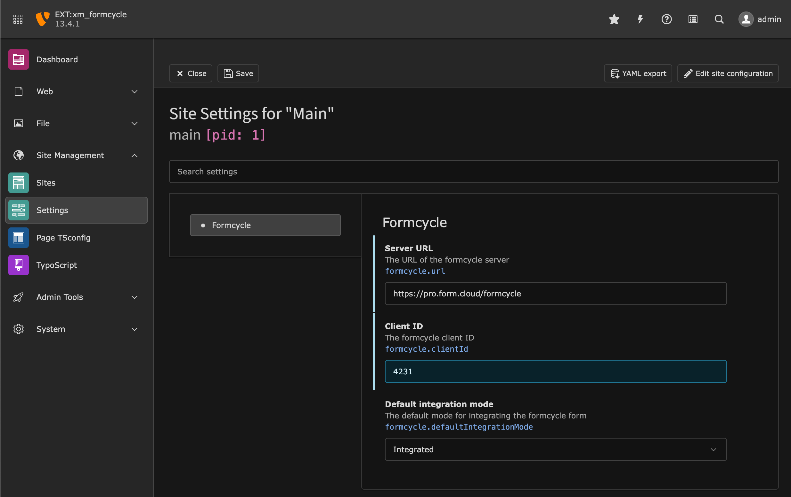

<div align="center">


# TYPO3 extension `xm_formcycle`

[](https://extensions.typo3.org/extension/xm_formcycle)
[](https://extensions.typo3.org/extension/xm_formcycle)
[](https://packagist.org/packages/xima-media/xm_formcycle/stats)
[](https://extensions.typo3.org/extension/xm_formcycle)
[](https://github.com/xima-media/xm_formcycle/actions/workflows/tests.yml)
[](https://codecov.io/gh/xima-media/xm_formcycle)
[](https://packagist.org/packages/xima/xima-typo3-formcycle)

</div>

A TYPO3 extension that connects to [formcycle](https://www.formcycle.eu/). Select your created forms and embed
them into your TYPO3 site.

## Requirements

* formcycle version 8 + installed plugin `Formularliste`
* PHP 8.1+

## Installation

### Composer

```bash
composer require xima/xima-typo3-formcycle
```

### TER

[](https://extensions.typo3.org/extension/xm_formcycle)

Download the zip file from
[TYPO3 extension repository (TER)](https://extensions.typo3.org/extension/xm_formcycle).

## Configuration in TYPO3 v13

The configuration of formcycle has been moved to
the [Site Sets](https://docs.typo3.org/m/typo3/reference-coreapi/main/en-us/ApiOverview/SiteHandling/SiteSets.html). Just add the Formcycle
Site Set to your Site Configuration:



After that, you can enter your Formcycle credentials via the Site Settings module:



### Form import

By default the extension fetches the list of available forms from the formcycle
server on every request (cached). Alternatively you can import the forms into the
TYPO3 database once and serve them locally — this avoids remote calls during
frontend rendering and enables the form list/detail display mode and the link
wizard.

**1. Define a storage folder**

Create a sysfolder that will hold the imported form records and set its page id as
the `formcycle.storagePid` site setting (Site Settings module, *Formcycle*
category). As soon as a storage PID is configured, forms are read from the local
database instead of the remote server.

Optionally set `formcycle.detailPid` to the page that contains the form detail
plugin, so list entries can link to their detail view.

**2. Run the import**

Import the forms for all configured sites via the CLI command:

```bash
typo3 formcycle:import-forms
```

The command creates new form records, updates changed ones and removes forms that
no longer exist on the formcycle server. Schedule it (e.g. via cron or the
scheduler) to keep the local data in sync.

### Route Enhancer

The route enhancer provides SEO-friendly URLs for the form detail view
(`/{form_id}`). In v14 it is loaded automatically via the site set. In v13 you
need to import the route enhancer configuration into your site configuration
manually:

```yaml
imports:
    - { resource: 'EXT:xm_formcycle/Configuration/Sets/Formcycle/route-enhancers.yaml' }
```

### Link wizard page restriction
To restrict the page tree in the link wizard to only show pages with formcycle form records, you can set it in you page TSconfig of your sitepackage:
```
// all configuration options are optional
TCEMAIN.linkHandler.formcycleForm {
    configuration {
        storagePid = 42
        pageTreeMountPoints = 42
        hidePageTree = 1
    }
}
```

## Developer

If you want to modify the [fluid template](Resources/Private/Templates/Formcycle.html), add template paths via
TypoScript constants:

```typo3_typoscript
plugin.tx_xmformcycle {
    view {
        templateRootPath = EXT:your_ext/Resources/Private/Templates
        partialRootPath = EXT:your_ext/Resources/Private/Partials
        layoutRootPath = EXT:your_ext/Resources/Private/Layouts
    }
}
```

Copy and modify the `Formcycle.html` to the Templates directory.

## Migration from version 9 to 10

If you are upgrading from version 9 to 10 (TYPO3 v12 to v13), you need to perform the following steps:

### 1. Migrate Extension configuration

The extension configuration of the formcycle URL and formcycle client ID have been moved to the TYPO3 system settings. You need to manually
migrate the settings from `$GLOBALS['TYPO3_CONF_VARS']['EXTENSIONS']['xm_formcycle']` to the `config/settings/<identifier>/settings.yaml`.

### 2. Run Upgrade wizard

In version 10 of this extension, the flexform settings have been moved to regular TCA fields. To migrate your existing content elements, run
the Upgrade Wizard in the TYPO3 backend or via CLI:

```bash
typo3 upgrade:run xmFormcycle_flexformMigrationddev
```

## License

This project is licensed under [GNU General Public License 2.0 (or later)](LICENSE.md).
